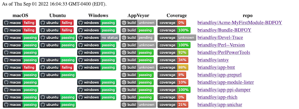

# brian's CPAN module dashboard

Inspired by Dave Cross's [dashboard](https://github.com/davorg/dashboard), I made my own. His is very nice (here's [https://cpandashboard.com/BDFOY/](https://cpandashboard.com/BDFOY/)), but I wanted something much more compact.

